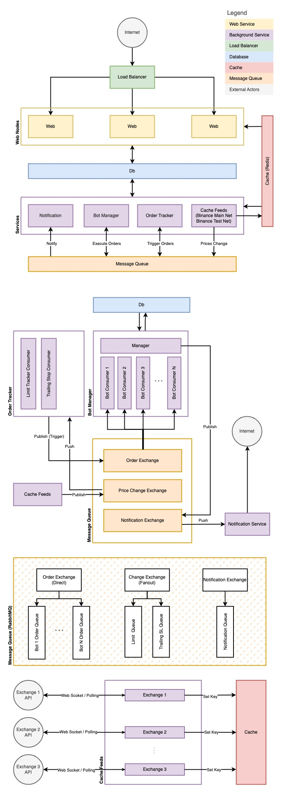

<div id="top"></div>

[![LinkedIn][linkedin-shield]][linkedin-url]

<!-- PROJECT LOGO -->
<br />
<div align="center">
  <a href="https://github.com/ahmetkoprulu/okkes">
    
  </a>

<h3 align="center">Astroid</h3>

  <p align="center">
    high performance trading bot that guarantees entry
    <br />
  </p>
</div>

<!-- TABLE OF CONTENTS -->
<details>
  <summary>Table of Contents</summary>
  <ol>
    <li>
      <a href="#about-the-project">About The Project</a>
      <ul>
        <li><a href="#features">Features</a></li>
      </ul>
    </li>
    <li>
      <a href="#getting-started">Getting Started</a>
      <ul>
        <li><a href="#basics">Basics</a></li>
        <li><a href="#architecture">Architecture</a></li>
        <li><a href="#development">Development</a></li>
      </ul>
    </li>
	    <li>
      <a href="#contribution">Contribution</a>
    </li>
    <li><a href="#license">License</a></li>
  </ol>
</details>

<!-- ABOUT THE PROJECT -->

## About The Project

Astroid is a trading bot that automates the process of executing trades in financial markets. It is highly configurable bot that utilizes various entry strategies to make sure entries are successfull.

### Features

- **Three Trading Modes:** Enables to safely trade one way, two way or swing.
- **Position Managing** Trailing stop loss, trailing take profit, pyramiding (DCA, ICA), moving take profits and more.
- **OBO Limit Orders:** Iterates order book to find the best price even in the volatile market
- **Entry Point Computation:** Also, direct entry point in the order book could be calculated by calculating standard deviation or directly executing c# code over specified order book samples.
- **Force Filling:** For large positions, place partial multiple orders to make sure entry is successfull
- **Dynamic SL, TP, Leverage:** Risk parameters can be manipulated in any signal.
- **Signal Source:** Works with any signal source that utilize webhooks.
- **Terminal:** Includes a terminal to monitor assets and executes orders manually.
- **Copy Trading:** You can copy trades from other users by subscribing to their bots.

<!-- GETTING STARTED -->

<!-- ## Getting Started

Astroid is a monorepo project composed by .Net Core 7 and Vue 2. You can easily run development server by using `npm run dev` or `yarn dev` for yarn. Most of the common tasks have its script. -->

### Basics

The two entities, **wallets** and **bots** are involved in the executing trading orders. To create a wallet, api keys of desired market should be obtained.

Supported Markets:

- **Binance**

Bots contains all the configuration to execute orders in the behalf of the assigned wallet. To execute an order, a request should send `to /api/bots/execute` endpoint. An example request body/alert message as follows;

```json
{
  "ticker": "BTCUSDT",
  "type": "open-long",
  "leverage": 20,
  "sl": 0.8,
  "tps": [
    { "target": 1, "share": 25 },
    { "target": 1.8, "share": 50 },
    { "taret": 3, "share": 25 }
  ],
  "key": "6614ff1e-b12d-43b0-bd0f-b6f3831c6b67"
}
```

**Key** field is required and unique to the bot. It tells which bot should execute the incoming order. The remaining fields may vary according to the strategy or pair that the signal produced for.

### Architecture

Key Components of astroid are shown in the following diagram. The whole system designed to be scalable and containerized to be deployed in any cloud provider or on-premise. it is composed by two main components, `Web` and `Services`.

"Web" is the main entry point of the application. It is responsible for handling incoming requests / signals and managing the bots.

"Services" is the component that process the orders. It is responsible for tracking asset prices, triggering and executing orders, and sending notifications(mail, sms or telegram) to users.

<div align="center">
  
</div>

### Development

Configs may be provided via environment variable or config files. _Check config.json_. Run `npm run dev` command to start web server. It will start the web server and the services. You can access the web server from `http://localhost:5000`. Run `npm run dev-services` to start background services (cache feeds, order tracker, notification). `npm run dev-bot-manager` to start bot manager service (responsible for executing orders on the exchanges). _All queues supposed to be created automatically by the dependant services but may need to be restart the services if not._

## Contribution

Contributions are welcome! If you'd like to contribute to Astroid, please follow these steps:

- Fork the repository.
- Create a new branch for your feature or bug fix.
- Make your changes and commit them.
- Push your changes to your fork.
- Submit a pull request with a detailed description of your changes.

<!-- LICENSE -->

## License

Distributed under the Attribution-NonCommercial 4.0 International (CC BY-NC 4.0) License. See `LICENSE.txt` for more information.

<!-- MARKDOWN LINKS & IMAGES -->
<!-- https://www.markdownguide.org/basic-syntax/#reference-style-links -->

[linkedin-shield]: https://img.shields.io/badge/-LinkedIn-black.svg?style=for-the-badge&logo=linkedin&colorB=555
[linkedin-url]: https://www.linkedin.com/in/ahmetkoprulu/
